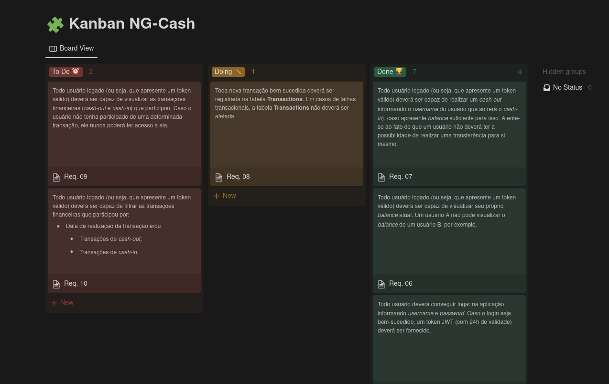

# ngcash-project
Neste projeto, foi solicitado para "estruturar uma aplicação web fullstack, dockerizada, cujo objetivo seja possibilitar que usuários da NG consigam realizar transferências internas entre si."

A aplicação está totalmente dockerizada e orquestrada em docker-compose. Para executá-la, siga os passos abaixo:

1. **Primeiro, deve-se instalar as dependências:** 
```  
    npm install
```

2. **Em seguida, deve subir a composição dos containers (neste caso, um container será resposável pelo banco de dados e o outro pela aplicação node) com o comando:**
```
    docker-compose up -d
```

3. **O próximo passo é "attachar" o terminal do container do node com o seguinte comando:**
```
    docker exec -it ng_cash_api sh
```

4. **Já no terminal do container (que deverá estar mostrando um prompt com /app), digitar o seguinte comando para criar o banco de dados com o schema do Prisma:**
```
    npx prisma db push
```
5. **Por fim, deve-se rodar a aplicação (em modo de desenvolvimento) para ter acesso aos endpoints:**
```
    npm run dev
```
<br>	
Com isso, já é possível interagir com a aplicação utilizando algum cliente REST como o Postman, Insomnia ou a extensão Thunder dentro do VSCode. Caso esteja utilizando o Postman ou o Thunder, há na raiz do projeto arquivos com os end-points já pré configurados ("ng-cash_postman.json" e "ng-cash_thunder.json" respectivamente.)
<br><br><br>

# End-points e instruções de uso:

#### **1. Criação do usuário** (é interessante criar mais de um usuário aqui para poder fazer as transações em seguida):
<hr>

  | Body da requisição | Método | Endpoint |
  |--------------------|--------|----------|
  |`{` <br> `"username": "Pessoa 1",` <br> `"password": "Abc12345"` <br> `}` | POST | localhost:3000/users |
  
  <br>

#### **2. Login** (gerará o token que deverá ser usado nas demais requisições)
<hr>

  | Body da requisição | Método | Endpoint |
  |--------------------|--------|----------|
  |`{`<br> `"username": "Pessoa 1",` <br> `"password": "Abc12345"` <br> `}` | POST | localhost:3000/login |

<br>

#### **3. Verificar saldo** (aqui, deve-se utilizar o token gerado no login)
<hr>

  | Header | Body da requisição | Método | Endpoint |
  |--------|--------------------|--------|----------|
  |Authorization: token |`{` <br> `"id": 1,` <br> `"accountId": 1` <br> `}` | GET | localhost:3000/account/balance |

<br>

#### **4. Transferência** (aqui, deve-se utilizar o token gerado no login)
<hr>

  | Header | Body da requisição | Método | Endpoint |
  |--------|--------------------|--------|----------|
  |Authorization: token |`{`<br> `"id": 1`, <--- Id do usuário origem <br> `"accountId": 1,` <--- Id da conta origem <br> `"username": "Guilherme",` <--- Username do usuário destino <br> `"value": 10` <--- valor a ser creditado <br> `}`| PATCH | localhost:3000/transaction/cashout |

<br>

# Considerações finais e observações:
- Nunca havia utilizado Postgres. Em razão disso, acabei optando por um ORM (aqui, cabe uma ressalva que li em diversos lugares - e mesmo na documenteção da própria ferramenta - que talvez o Prisma não seja de fato um ORM, mas enfim... ) que eu também nunca havia utilizado: o Prisma. Gostei bastante de utilizar ambos e como primeira contato, fiquei feliz com o resultado;

- Inicialmente, pensei em utilizar a biblioteca Zod para a validação (já que utilizei num projeto da Trybe direto na camada model e gostei bastante) mas não consegui adaptá-la ao Prisma. Tentei depois usar a Joi, mas também não estava dando certo. Acabei utilizando uma validação própria, direto na camada service... Não ficou muito elegante, mas cumpriu o propósito (e como eu estava sem tempo, me contentei com isso);

- Tive um problema particular bem sério e acabei não conseguindo concluir todos os requisitos solicitados e fiquei entre a "cruz e a espada": entregar o que eu havia feito até então dentro do prazo e com alguma funcionalidade minimamente utilizável, ou entregar atrasado mas com um pouco mais de funcionalidades. Acabei optando pela primeira opção. Entendo que provavelmente terão entregas muito melhores e mais completas do que a minha e fico um pouco chateado porque sinto que eu poderia fazer mais e melhor mas, parafrasendo John Lennon: 
```
    "a vida é o que acontece com a gente enquanto estamos fazendo outros planos"
```

- Print do Kanban que eu fiz no Notion para me organizar:

